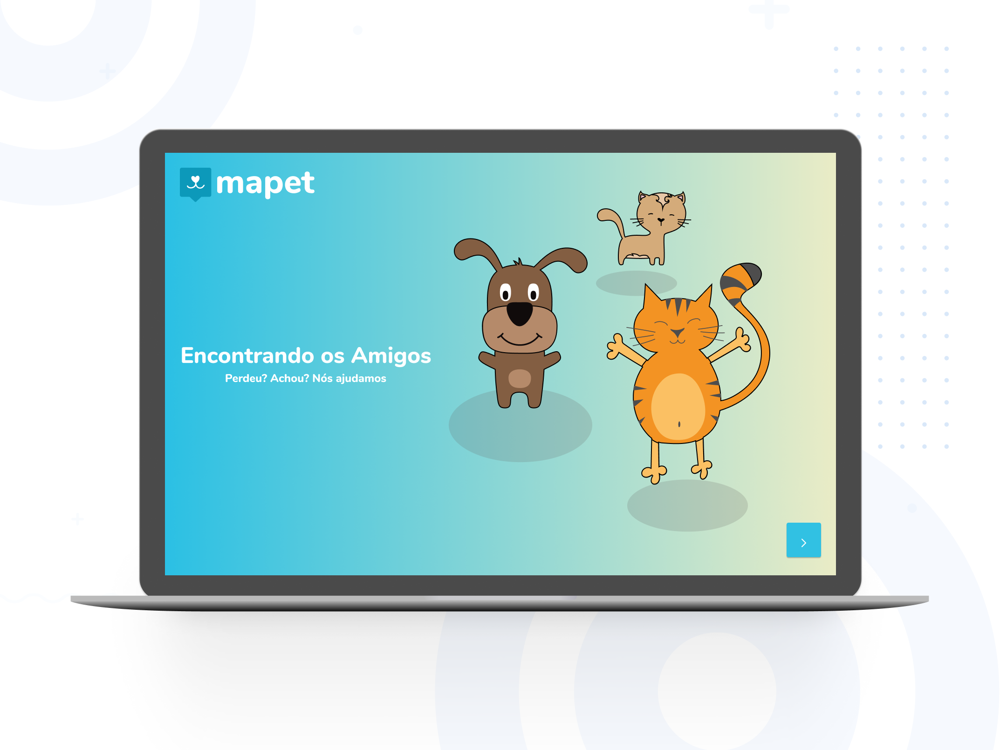

[Acesse Aqui](https://mapet-web.herokuapp.com/)

## Mapet
Um aplicativo que lhe ajudará a encontrar seu pet perdido.

## Motivação
Inspirado no aplicativo **Happy** desenvolvido durante a [NLW3](https://nextlevelweek.com/) da [Rocketseat](https://rocketseat.com.br/) e com o objetivo de fixar o conhecimento adquirido e buscar novos desafios na stack de desenvolvimento utilizada [Node.js](https://nodejs.org/en/), [ReactJS](https://pt-br.reactjs.org/) e [React-Native](https://reactnative.dev/) resolvi desenvolver o Mapet.

Muitas pessoas tem bichinhos de estimação, entre eles os mais comuns são gatos e cachorros. Com a correria do dia a dia pode acontecer deles acabarem escapando, e ai aonde divulgar para ajudarem a encontrá-lo o mais rápido possível? Redes Sociais? WhatsApp?
Pensando nisso criamos o mapet, um mapa que você indica aonde seu pet foi visto pela última vez, características, fotos e até oferecer uma recompensa.
Assim centralizamos todas as informações em um único lugar.

## Code style

 
## Tecnologias e frameworks utilizados
- [ExpessJS](https://expressjs.com/pt-br/)
- [TypeScript](https://www.typescriptlang.org/)
- [ReactJS](https://pt-br.reactjs.org/)
- [React Leaflet](https://react-leaflet.js.org/)
- [Leaflet](https://leafletjs.com/)
- [MapBox](https://www.mapbox.com/)
- [BrasilAPI](https://brasilapi.com.br/)
- [Node Geocoder](https://github.com/nchaulet/node-geocoder)
- [Prettier](https://prettier.io/)
- [Eslint](https://eslint.org/io)
- [TypeORM](https://typeorm.io/)
- [MariaDB](https://mariadb.org/)
- [Multer](https://github.com/expressjs/multer)
- [Cloudnary](https://cloudinary.com)
- [Yup](https://github.com/jquense/yup)
- [Axios](https://github.com/axios/axios)
- [Date-fns](https://date-fns.org/)
- [Styled Components](https://styled-components.com/)
- [React Icons](https://react-icons.github.io/react-icons/)
- [React Toastfy](https://github.com/fkhadra/react-toastify)
- [React Hook Form](https://react-hook-form.com/)

## Futuro
Futuramente irei desenvolver a applicativo para celulares utilizando [React-Native](https://reactnative.dev/)

## Créditos
O projeto está aberto para quem quiser usar como referência ou consulta, mas está proibida a comercialização ou qualquer tipo de arrecadação monetária. 

Developed with love © [Renato](https://github.com/renatoosaka/)
